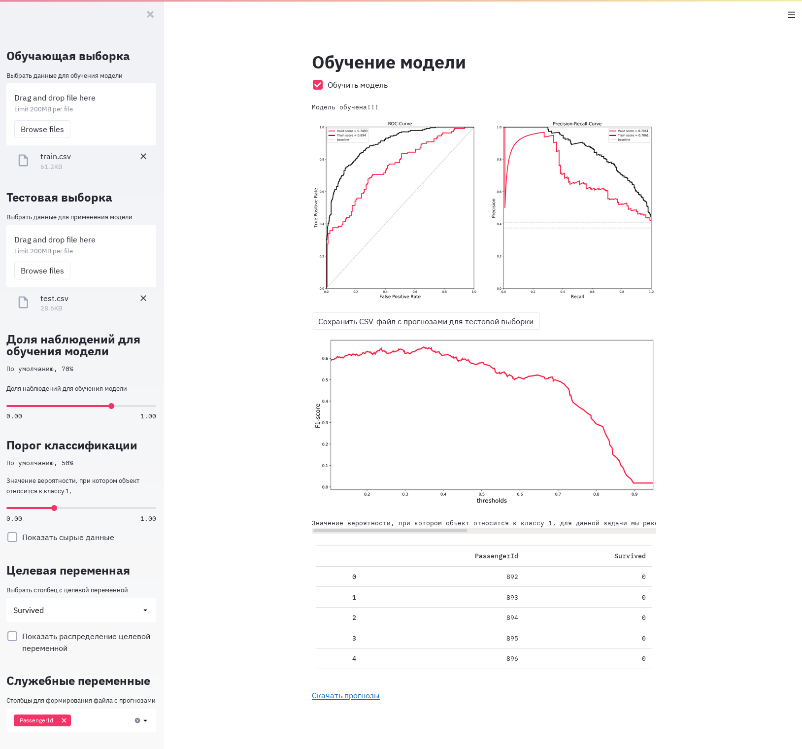
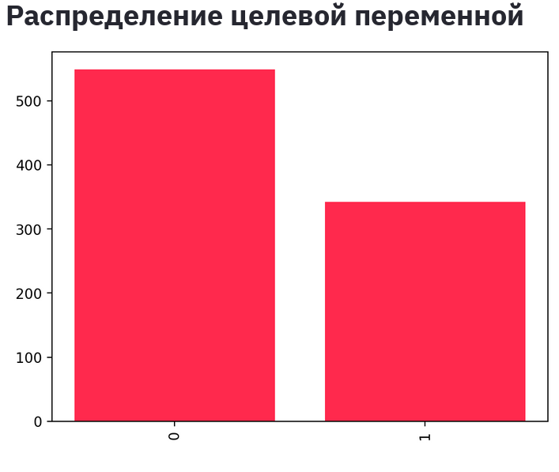

# CraftML


CraftML is an automated model building tool that allows you to solve machine learning problems without programming, using a graphical interface. Various autoML frameworks are used to build models.

Most users will prefer using CraftML without modification. Advanced users will be able to use the solution in their tasks through the API. The source code is provided so that enthusiastic developers can add new pipeline elements and improve this solution. 

## Getting Started with CraftML

Download the distribution, load your data into it, expect the result.

Web version - https://share.streamlit.io/nv-27/craft_ml_app/app.py

Test dataset - https://github.com/OptimizationGuys/CraftML/raw/main/Titanic.zip

## Run locally

You'll need `python` interpreter and `streamlit` python package.
Then you can easily run a demo application following this steps.

1. Clone the repository:
    ```
    git clone https://github.com/OptimizationGuys/CraftML.git
    ```

2. Move to the directory with this project
    ```
    cd CraftML
    ```
3. Then run
    ```
    pip install -e .
    streamlit run app.py
    ```


## PC Requirements
* OS: Ubuntu 18.04
* Processor: more than 2 cores
* RAM: 8 GB.
* Video card: Open GL 3.2
* Disk space: 2 GB

## Plans
* Appimage or portable app distribution (zip)
* Application status, dashboard with charts
* Two modes: simple and advanced
* Add H20 (autoML)
* Add API description
* Working with time-series
* Working with pictures
* Connect to AWS 


## Team
* [vuvko](https://github.com/vuvko) - DS/Backend
* [NV-27](https://github.com/NV-27) - DS/Frontend 
* [Zabis13](https://github.com/Zabis13) - PO/Analyst 
* [Sergey-Pravdyukov](https://github.com/Sergey-Pravdyukov) - Developer 

## License
[MIT](https://choosealicense.com/licenses/mit/)


## Screenshots
Screencast - https://github.com/OptimizationGuys/CraftML/blob/main/screenshots/CraftML%20-%20video



